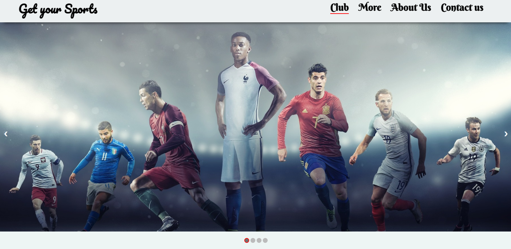

# Get your sports
HTML website template for sports

Website Link: https://get-your-sports.vercel.app/

## Screen

# Get Your Sports

This is the `get-your-sports` project, a sports-related website designed to provide users with the latest news and updates about various sports. This project has been adapted and customized by Quantum Inspire AI, with the aim of creating a more inclusive digital space for individuals with disabilities.

## Description

This project is part of a larger initiative by Quantum Inspire AI to harness the capabilities of technology to create a global impact, particularly for the disabled community. The vision is to transcend geographical boundaries, as disabilities are a global concern. The objective is to demonstrate that individuals with disabilities, whether dyslexia or physical limitations, can not only find employment in the tech industry but also thrive in its most innovative sectors.

## Acknowledgements

We would like to express our deepest gratitude to the creators of the `get-your-sports` template. Their hard work and dedication have made this project possible. We are also grateful for the opportunity to collaborate with advanced technological platforms like ChatGPT and Bing. This collaboration is deeply appreciated and serves as a cornerstone for our future endeavors.

Quantum Inspire AI would also like to acknowledge the invaluable assistance provided by AI agents in the development of this project. Their contribution has been instrumental in making this project a reality, demonstrating the transformative power of AI in creating a more inclusive world.

## Installation

To install this project on your local machine, follow these steps:

1. Clone the repository: `git clone https://github.com/anthnystnly/get-your-sports.git`
2. Navigate to the project directory: `cd get-your-sports`
3. Install the necessary dependencies (if any).

## Usage

To use this project, simply open the `index.html` file in your web browser.

## Contributing

If you want to contribute to this project, please create a new branch, make your changes, and then submit a pull request.

## License

This project is licensed under the MIT License.
